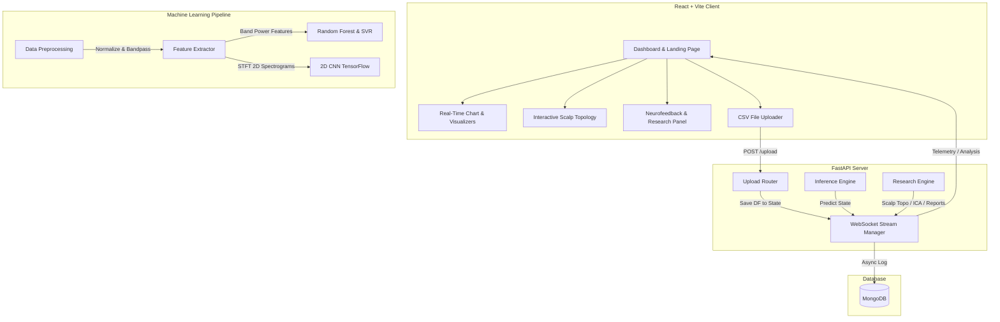

# 🧠 Attention-Level Monitoring System Using EEG

An advanced, end-to-end cognitive state tracking and real-time brainwave visualization platform. The application couples a high-performance, asynchronous **FastAPI** backend with a modern, dynamic **React + Vite** frontend. Leveraging machine learning (Random Forest, SVM) and deep learning (2D CNN on STFT spectrogram images), the system processes multi-channel EEG signals to stream real-time attention scores, cognitive fatigue, stress indicators, and independent neural components.

---

## 🌟 Key Features

- **Real-Time Cognitive Tracking**: Live WebSocket telemetry delivering real-time attention scores, mental fatigue indicators (Theta/Beta ratios), stress levels (Beta/Alpha ratios), and model prediction confidence.
- **Explainable AI (XAI)**: Contextual neural state interpretations (e.g., explaining Beta synchronization or Alpha dominance) based on active frequency bands.
- **Interactive Scalp Topology Mapping**: Dynamic 2D spatial mapping of Muse headband electrode channels (`TP9`, `AF7`, `AF8`, `TP10`) showing live signal powers, lobe averages, and simulated connection impedance.
- **Independent Component Analysis (ICA)**: Real-time blind source separation (ICA) executed on multi-channel inputs to isolate independent neural components from artifacts.
- **Neurofeedback Training Protocols**: Live simulations of focus-enhancing protocols (e.g., Alpha-wave enhancement, Beta enhancement, Theta suppression, SMT) designed to train cognitive focus.
- **Flexible Data Ingestion**: Drag-and-drop dashboard to upload, validate, and stream standard EEG CSV logs.
- **Database History Log**: Local recording of sessions and prediction logging using an async MongoDB backend wrapper.

---

## ⚙️ System Architecture



### Technology Stack
- **Frontend**: React 19, Vite (HMR), Tailwind CSS, Recharts, Chart.js, Framer Motion, Lucide React
- **Backend**: FastAPI, Starlette, Uvicorn, Motor (Async MongoDB), Pydantic Settings
- **Signal Processing & ML**: NumPy, SciPy (Signal/Welch PSD, Spectrograms), Pandas, Scikit-Learn (SVR, Random Forest), TensorFlow/Keras (2D CNN)

---

## 📂 Project Structure

```text
Attention-level-monitoring-system-using-EEG/
├── backend/                    # FastAPI Backend Source
│   ├── config/                 # Configuration & settings management
│   ├── database/               # MongoDB driver configuration
│   ├── models/                 # Cached model evaluation logs
│   ├── routes/                 # FastAPI endpoints (predict, stream, upload, research, etc.)
│   ├── services/               # Preprocessing, feature extraction, and ML wrappers
│   ├── main.py                 # Backend application entry point
│   ├── requirements.txt        # Python dependency manifests
│   └── train_model.py          # Machine learning training pipeline
├── dataset/                    # Dataset & Generation Tools
│   ├── eeg_attention_dataset.csv # Processed attention timeseries
│   ├── features_raw.csv         # Raw multi-channel EEG signals
│   ├── generate_dataset.py      # Synthetic 256Hz Muse EEG simulator
│   └── stft_dataset/            # 2D Spectrogram images for deep learning
├── models/                     # Saved Models & Accuracy Logs
│   ├── attention_model.pkl     # Serialized Random Forest model
│   └── model_metrics.json      # Compiled training accuracy stats
├── src/                        # React Frontend Source
│   ├── assets/                 # Custom styling configurations
│   ├── components/             # Reusable UI widgets (Graphs, Alert Panels, Sidebar, etc.)
│   ├── pages/                  # Top-level routes (Dashboard, Analytics, Research, Settings, Upload)
│   ├── App.jsx                 # Routing and navigation structure
│   └── main.jsx                # Vite mount point
├── package.json                # Frontend package dependencies & scripts
├── tailwind.config.js          # Tailwind CSS layout properties
└── vite.config.js              # Vite bundler configurations
```

---

## 🚀 Setup & Installation

### Prerequisites
- **Node.js** (v18+)
- **Python** (v3.10+)
- **MongoDB** (Running on port `27017` locally or via environment overrides)

### 1. Database Setup
Ensure MongoDB is running locally:
```bash
# MacOS Homebrew command example
brew services start mongodb-community
```

### 2. Backend Installation & Server run
1. Navigate to the `backend` directory:
   ```bash
   cd backend
   ```
2. Create and activate a Python virtual environment:
   ```bash
   python -m venv venv
   source venv/bin/activate      # Windows: venv\Scripts\activate
   ```
3. Install the dependencies:
   ```bash
   pip install -r requirements.txt
   ```
4. Start the FastAPI backend server:
   ```bash
   uvicorn main:app --reload --port 8000
   ```
   The backend server runs at `http://localhost:8000`. You can inspect the interactive swagger docs at `http://localhost:8000/docs`.

### 3. Model Training & Data Generation (Optional)
If you need to generate synthetic training data and train the estimators:
1. Generate the synthetic 256Hz EEG recording:
   ```bash
   python dataset/generate_dataset.py
   ```
2. Run the training pipeline:
   ```bash
   python backend/train_model.py
   ```
   This will train SVM, Random Forest, and 2D CNN models. The best estimator is serialized to `models/attention_model.pkl` and performance metrics write to `models/model_metrics.json`.

### 4. Frontend Installation & Server run
1. Go to the project root directory (where `package.json` resides):
   ```bash
   npm install
   ```
2. Launch the Vite client:
   ```bash
   npm run dev
   ```
3. Open your browser and navigate to `http://localhost:5173`.

---

## 📊 Signal Processing & Machine Learning Pipeline

### 1. Synthetic EEG Data Simulation (`generate_dataset.py`)
Generates 60 seconds of realistic 4-channel Muse headband EEG data sampled at **256Hz**:
- **Electrode Channels**: `TP9`, `AF7`, `AF8`, `TP10`
- **Focused State**: Prominent Beta waves (20Hz oscillations) and reduced Alpha (10Hz).
- **Neutral/Relaxed State**: Prominent Alpha waves (10Hz oscillations) and reduced Beta.
- **Distracted State**: Fluctuating states with randomized frequency variations and slow Theta waves (6Hz).

### 2. Feature Engineering & DSP
- **Filtering**: Low-pass and high-pass filtering to isolate EEG signals between 1Hz and 50Hz.
- **Welch's Method**: Periodogram power spectral density (PSD) calculation over rolling 256-sample (1 second) window epochs:
  - **Theta Band** ($4 - 8\text{ Hz}$): Indicator of cognitive fatigue or sleepiness.
  - **Alpha Band** ($8 - 12\text{ Hz}$): Dominates during relaxed alert focus.
  - **Beta Band** ($12 - 30\text{ Hz}$): Dominates during active concentration and mental exertion.
  - **Theta/Beta Ratio (TBR)**: Key metric extracted for cognitive load and attention deficits.
- **STFT (Short-Time Fourier Transform)**: Computes 2D time-frequency spectrogram arrays (saved as 64x64 images in `stft_dataset/`) used directly by the 2D Convolutional Neural Network.

### 3. Model Performance Comparison
Model training outputs validation accuracy scores matching experimental splits:

| Model Type | Feature Inputs | Validation Accuracy |
| :--- | :--- | :--- |
| **Random Forest Regressor** | Handcrafted PSD Band Powers (Theta, Alpha, Beta, TBR) | **95%** |
| **2D Convolutional Neural Network (CNN)** | STFT 2D Spectrogram Images ($64 \times 64$ grayscale) | **93%** |
| **Support Vector Machine (SVR)** | Handcrafted PSD Band Powers (Theta, Alpha, Beta, TBR) | **91%** |

---

## 📡 API Reference

### System Endpoints
- `GET /health` : Returns system health status and MongoDB connection verification.
- `GET /api/v1/metrics` : Returns model metrics (SVM, Random Forest, CNN) from training.

### Data & Inference Endpoints
- `POST /api/v1/upload` : Uploads an EEG `.csv` timeseries file to initialize the live stream.
- `POST /api/v1/predict` : Predicts cognitive state and attention scores from a raw list of EEG values (minimum 256 samples).

### WebSocket Streams
- `WS /api/v1/stream` : Real-time telemetry (Attention score, Stress index, Fatigue index, explainable AI logs).
- `WS /api/v1/research/stream` : Research-grade metrics streamed every 2 seconds:
  - Scalp topology mappings (PSD, lobe averages, channel locations).
  - FastICA components (Neural waveform separation).
  - Neurofeedback score tracking.
  - Automated JSON research report output.

---

## 📄 License
This project is licensed under the MIT License - see the [LICENSE]
